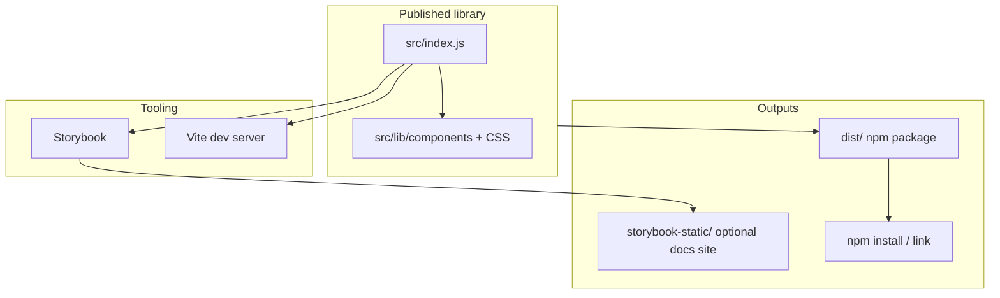

# Architecture

## High-level picture

This repository is **three things at once**, each with a clear role:

## Source layout

| Path | Purpose |
|------|---------|
| `src/lib/` | **Library-only** code: components and their CSS. This is what ships in the npm package (via the bundle in `dist/`). |
| `src/index.js` | **Public API**: re-exports components. Keep this file small and stable; it is the Rollup/Vite library entry. |
| `src/App.jsx` | **Playground** for the Vite app (`index.html`). Imports from `./index` to mimic a consumer app. Not part of the published bundle. |
| `src/main.jsx` | Vite app bootstrap. |
| `src/stories/` | **Storybook** stories and MDX. Stories import from `../index` so they exercise the same public API consumers use. |

## Two Vite configurations

| File | Used by | What it builds |
|------|---------|----------------|
| `vite.config.js` | `npm run dev`, `npm run preview`, Vitest + Storybook test plugin | The **development app** (standard Vite SPA from `index.html`). Also defines Storybook-related Vitest browser tests. |
| `vite.lib.config.js` | `npm run build` (default **library** build) | **`dist/`**: ESM + CJS + one aggregated CSS file. |

The **library build** does not bundle `react` or `react-dom`; it marks them as external so consumers supply a single copy. `prop-types` is bundled with the library output.

## Build outputs

### `dist/` (library — `npm run build`)

| Artifact | Role |
|----------|------|
| `reactjs-storybook.js` | ES module entry (`import`). |
| `reactjs-storybook.cjs` | CommonJS entry (`require`). |
| `reactjs-storybook.css` | Styles for all components in the bundle (single file because `cssCodeSplit` is off for the lib build). |

`package.json` `exports` maps:

- `"."` → JS entry points.
- `"./style.css"` → the CSS file (for `import 'reactjs-storybook/style.css'`).

### `storybook-static/` (`npm run build-storybook`)

Static Storybook build suitable for hosting (e.g. GitHub Pages or an internal static server). Not required for publishing the **component** package to npm.

### Playground static app (`npm run build:playground`)

Produces a Vite **app** build (not the library). Use when you want a deployable demo of `App.jsx` that is separate from Storybook.

## What npm publishes

Configured `files` in `package.json` include `dist` plus documentation so installs from the registry still include the guides. The runtime package is **only** the contents of `dist/` for JS/CSS; `src/` is not published unless you change `files`.

## Dependency roles

| Dependency | Role |
|------------|------|
| `react`, `react-dom` | **Peer**: provided by the host application. |
| `prop-types` | **Dependency** of this package: shipped in the bundle for runtime prop validation in development. |
