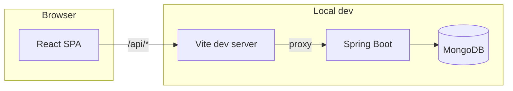

# Architecture

This document describes how **Project Munshi** is structured and how the pieces talk to each other.

## High-level diagram

In **development**, the React app is served by Vite (default port **3000**). Requests to `/api/*` are **proxied** to the Spring Boot server (**8080**), avoiding CORS issues during local work.

In **production**, you typically deploy the built static assets behind a web server or CDN and point the frontend’s API base URL at the real backend host (no Vite proxy).

## Backend layers

| Layer | Responsibility |
|-------|----------------|
| **Controller** (`ProjectController`, `HealthController`) | HTTP mapping, validation trigger, status codes. |
| **Service** (`ProjectService`) | Business rules: soft delete, filtering deleted records, bulk create. |
| **Repository** (`ProjectRepository`) | Spring Data MongoDB persistence. |
| **DTO** (`ProjectRequest`, `ProjectResponse`) | API input/output shape separate from the domain model when needed. |
| **Exception handling** (`GlobalExceptionHandler`, `ErrorResponse`) | Consistent error payloads. |

## Frontend structure

| Area | Role |
|------|------|
| **`App.tsx`** | Router setup: list, create, edit, details. |
| **`components/`** | Screens and UI: forms, list, cards, markdown, CSV import, modal. |
| **`services/projectApi.ts`** | All HTTP calls to `/api/projects` and related routes. |
| **`types/project.ts`** | TypeScript types aligned with API fields. |

## Data flow examples

1. **List projects** — `ProjectList` → `getAllProjects()` → `GET /api/projects` → service filters by `deleted` unless the “include deleted” query is used (see [backend-api.md](./backend-api.md)).
2. **Soft delete** — User confirms in `ConfirmationModal` → `deleteProject(id)` → `DELETE /api/projects/{id}` → service sets `deleted=true`.
3. **CSV import** — `CsvImport` parses and validates rows → `createProjectsBulk()` → `POST /api/projects/bulk` → multiple documents inserted.

## Cross-cutting concerns

- **Validation**: Jakarta Bean Validation on `ProjectRequest` for create/update/bulk.
- **API docs**: SpringDoc OpenAPI; interactive UI paths may vary slightly by version (see [setup-and-run.md](./setup-and-run.md)).
- **Markdown in descriptions**: Rendered only on the client with `marked` and `prismjs`; the API stores description as plain text.

## Related documents

- [Setup and Run](./setup-and-run.md)
- [Backend API Reference](./backend-api.md)
- [Frontend Guide](./frontend-guide.md)
- [CSV Import](./csv-import.md)
